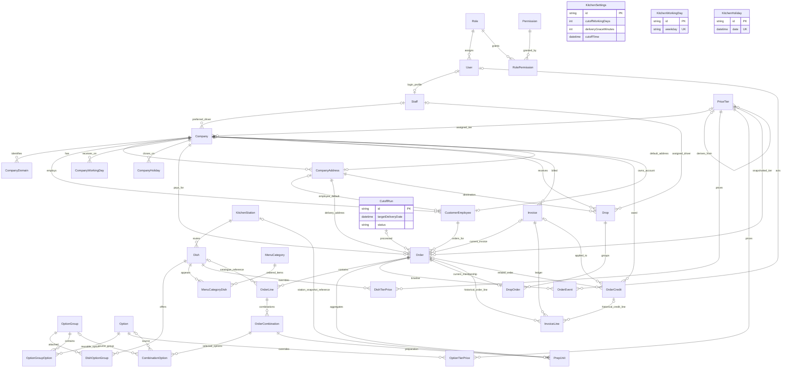

# Fernleaf Kitchen

Fernleaf Kitchen is an internal admin platform for a fictional commercial kitchen serving corporate meal programs. Staff manage menus and employee orders, prepare meals by kitchen station, group deliveries into Drops, and bill the employee's company. Customer employees are business records, not application login accounts; there is no customer-facing application.

The operational lifecycle is menu availability and pricing → draft/order placement → kitchen cutoff confirmation → preparation → dispatch → delivery → company invoicing and credits. NestJS enforces permissions, state transitions, quantities, prices and transaction rules on the server.

**Review status:** core domains are implemented. The latest recorded verification passed the API typecheck and selected account/billing/dashboard regressions, but the P0-8 full demo seed/rollover suites failed during setup. Fresh seeding and today's demo driver visibility are therefore not verified green. See [Testing](#testing) and [What was skipped](#what-was-skipped); this README does not claim a completed deployment or a passing full suite.

## Architecture

```text
Next.js
   ↓ HTTP
NestJS
   ↓
Prisma
   ↓
PostgreSQL
```

- **Frontend:** Next.js App Router pages in `apps/web/app`, reusable components and typed HTTP helpers in `apps/web/lib/api`. AuthContext and permission-aware UI gate routes/actions. Requests include credentials and default to the same-origin `/api` rewrite. No Next.js server actions implement the order/pricing/billing domain.
- **Backend:** a NestJS modular monolith. Controllers bind routes, permission decorators and DTOs; services orchestrate workflows; Orders uses a repository plus domain helpers. Global authentication/permission guards, DTO transformation/whitelisting, domain errors, exception handling and request IDs are shared infrastructure.
- **Database:** PostgreSQL through Prisma and the pg adapter. The schema and migrations live under `apps/api/prisma`. Relational keys, unique indexes and SQL CHECK constraints protect persisted invariants. Monetary values are integer cents; tier multipliers/percentages are integer basis points.

### Workspace and module boundaries

```text
apps/api/
  src/             NestJS modules, controllers, services, domain helpers
  prisma/          schema, migrations, seed helpers, PostgreSQL constraints
  test/            HTTP/database E2E and concurrency regression specs
apps/web/
  app/             internal workflow pages
  components/      reusable UI
  lib/             API client, auth and frontend helpers
packages/shared/   workspace package scaffold
docs/explanation/  implementation-stage notes
P0-*-REVIEW.md      focused repair/verification records
```

`packages/shared` is currently a scaffold, not a complete published contract library. There is no root-level Prisma schema or orchestration scripts directory. Earlier stage notes describe intermediate scope; current source takes precedence.

| Backend boundary | Responsibility |
| --- | --- |
| `auth`, `staff` | Internal credentials, roles/grants, staff profiles and account management |
| `catalogue`, `files` | Dishes/options/groups/reference data and database-backed images |
| `pricing`, `menu` | Tier strategies, effective prices, menu membership/visibility/preview |
| `companies`, `employees` | Corporate accounts, receiving calendars, defaults and employee preferences |
| `orders` | Quotes, validated snapshots, state transitions, aggregate mutations and admin overrides |
| `kitchen` | Time/clock, settings/calendar/cutoff processing, prep-unit board |
| `dispatch`, `driver` | Drop readiness, assignment, departure, delivery and driver-owned views |
| `billing`, `dashboard` | Invoice/credit transactions and role-specific read models |
| `demo`, `prisma`, `common`, `health` | Demo maintenance, database access, shared infrastructure and connectivity |

## Implemented features

### Authentication & authorization

JWT login uses a 12-hour `fernleaf_token` HTTP-only cookie, with Bearer tokens accepted by the API guard. Cookies are SameSite=Lax and Secure in production. Passwords use bcrypt with cost factor 12. Logout clears the cookie; there is no refresh-token/revocation ledger.

Users have one database role; `RolePermission` grants named capabilities. Every protected API request reloads the user, rejects inactive accounts and checks required permissions. Staff management includes role and activation changes. Frontend navigation/actions use profile permissions for usability; backend guards provide authorization.

### Catalogue

Dishes carry a unique SKU, description, image reference, HOT/COLD temperature, integer cost, allergens, dietary tags, kitchen station, portion size and optional minimum order quantity. Reference data and catalogue entries have active/deactivated states.

Options are reusable across option groups. Groups have required/optional behavior, selection limits and display order; dish/group links and group/option memberships have their own configuration. The combination validator checks active membership, duplicate selections, required selections, MOQ and positive quantities. Inactive items cannot be newly ordered through the menu/order builder.

Images use `DbFile` database storage. The file service accepts JPEG/PNG/WebP up to 2 MiB, stores checksum/metadata and bytes, and serves protected downloads. An object-storage adapter is not implemented.

### Menu

`MenuCategory` and `MenuCategoryDish` define ordered category membership, active state and secret categories. Company-specific hidden categories/dishes affect both preview and orderability. Staff can preview in company/employee context; an employee context must belong to the requested company.

Normal browse omits secret categories. Direct slug/category paths may use them, but still enforce active state, company hiding and a resolvable price. Missing prices hide items and make ordering fail; they are never interpreted as free. Menu preview shows dish prices; option pricing is resolved when combinations are priced.

### Pricing

Named tiers support a default tier, company assignments, explicit dish/option overrides and derived prices. A PostgreSQL partial unique index permits **at most one** default tier; services require a usable active default where needed.

`PricingResolver` uses explicit-price, cost-multiplier and base-tier-percentage strategies. Explicit values win; otherwise COST_MULTIPLIER applies configured basis points to cost, and BASE_MARKUP applies a percentage increase to a resolved base-tier price. Derived prices round **up to the next 5 cents**; explicit prices are retained as supplied. Tier chains reject invalid/cyclic derivation. Missing base prices remain missing.

Order creation/line changes snapshot the effective price. Changing live catalogue/tier prices does not automatically reprice existing orders.

### Companies & employees

Companies have domains, legal/billing contacts, a pricing tier, multiple delivery addresses, an optional owner employee, receiving weekdays/holidays and hidden menu settings. Delivery defaults include address, time, packaging, preferred driver and leave-kitchen minutes.

Customer employees have active state, default address, allergy/dietary links and flags governing whether address/time/packaging may be selected. These preferences are stored; there is no automated dietary recommendation or allergen substitution engine. Services validate company ownership of referenced employees/addresses and eligibility of preferred drivers.

### Orders

Orders support quotes, creation, listing/search/filtering/pagination, full edits, combination-based line differences, placement, cancellation/rejection and milestone events. Listing filters include status, company, date range and invoiced state. Shared pagination defaults to page 1/limit 20, with limit capped at 100; order listing also accepts its documented page-size alias.

```text
DRAFT → PLACED → CONFIRMED → IN_KITCHEN → READY → DISPATCH_READY → OUT_FOR_DELIVERY → DELIVERED

DRAFT → CANCELLED
PLACED → CANCELLED or REJECTED
```

Cutoff processing confirms placed orders and cancels drafts. Combination quantities sum exactly to each line quantity; signatures identify distinct selections; option-group membership, required groups, selection limits and MOQ are enforced. Totals derive from persisted/priced combinations and lines.

Snapshots preserve employee/company associations, delivery address details, packaging/tier names, dish details, option/group names and prices, station details and planning inputs. Menu eligibility is evaluated at build time; there is no independent published-menu snapshot entity on an order line.

### Kitchen

Each order combination has at most one `PrepUnit`, carrying quantity, dish/station snapshots and progress timestamps. The board groups CONFIRMED, IN_KITCHEN and READY orders by station/date. Start/done update units and aggregate order readiness; privileged force-complete finishes eligible orders.

Planned dispatch readiness is delivery instant minus the company's snapshotted leave-kitchen minutes. Planned kitchen readiness is another **30 minutes earlier**. These planned fields are distinct from actual preparation/departure/delivery timestamps.

### Dispatch & driver

Dispatch-ready requires kitchen READY. A Drop becomes ready when all its member orders are dispatch-ready; departure requires a ready Drop with a driver. Delivery requires OUT_FOR_DELIVERY. Drivers must be active staff linked to active users holding `driver.update`.

Drops group by **company + address + delivery date + exact delivery time**. An order has at most one current Drop membership. Driver endpoints scope today's deliveries to the authenticated user's Staff record and validate ownership when delivering. Delivery notes and optional photos are supported.

Backend assignment works, but the Dispatch-role frontend driver picker is pending: it calls the company eligible-driver endpoint, which requires `companies.view`, absent from the Dispatch role. Admin has that permission. No backend permission expansion was authorized.

### Billing

Invoice creation accepts selected billable, uninvoiced orders from **one company** and can group multiple orders. Billable states are CONFIRMED, IN_KITCHEN, READY, DISPATCH_READY, OUT_FOR_DELIVERY and DELIVERED; delivery is not a prerequisite.

The schema has DRAFT/ISSUED/PAID/VOID states; the create endpoint creates ISSUED invoices. Mark-paid records PAID, not payment transactions or partial payments. Invoice numbers are unique. `Order.invoiceId` represents current billing; historical invoice lines remain after voiding, so an order can be re-invoiced once its current link is cleared.

Credits are positive integer cents tied by the create endpoint to an order/company. Cumulative order credits cannot exceed the order total. Credits can be applied to an eligible unpaid invoice or remain unapplied for later billing. Paid/void invoice ledgers are not amended by attaching credits.

### Dashboards

Admin sees operational and billing totals/setup gaps; Kitchen sees station prep/deadlines; Dispatch sees Drop status/load and departure risks; Driver sees only assigned deliveries. Definitions below document actual query filters rather than inferred business labels.

## Data model

The diagram uses actual Prisma model names. Join models are retained where they express pricing, membership or ownership constraints; ancillary allergen/tag/file and visibility joins are omitted from the diagram for readability.



`CustomerEmployee` is the employee entity, `CompanyAddress` the address entity, `MenuCategoryDish` the menu-item join, and `CombinationOption` the selected-option snapshot. Settings is a singleton; kitchen weekdays/holidays are global tables read by the calendar service and have no artificial Settings foreign key. Company receiving calendars are separate. Optional source references coexist with historical snapshot fields. Historical invoice/credit lines intentionally are not globally unique by order/credit ID because void/rebilling retains history.

## Local setup

Use **pnpm 12.8.1**, pinned by the root package manager configuration. There is no repository Node engine pin. The installed Prisma package requires Node `^20.19 || ^22.12 || >=24.0`; Next.js requires `>=20.9.0`. The latest recorded checks used Node 24.19.0.

PostgreSQL must already be running with a database and migration-capable credentials; there is no checked-in Docker Compose setup. No PostgreSQL server version is pinned.

1. From the repository root, install dependencies:

   ```sh
   pnpm install
   ```

2. Create `apps/api/.env` using the root `.env.example` as a template. Replace database credentials and the JWT placeholder. Put frontend overrides, if needed, in `apps/web/.env.local`. Do not copy real secrets into documentation.
3. Generate the client and apply migrations as described below.
4. The normal seed command is documented below, with its current P0-8 blocker. Fresh startup also invokes this path and is affected by the blocker.
5. Start each app in a separate terminal:

   ```sh
   pnpm --filter api start:dev
   ```

   ```sh
   pnpm --filter web dev
   ```

The root has **no `pnpm dev` script**. API `start:dev` is `nest start --watch`; web `dev` is `next dev`. Defaults are frontend `http://localhost:3000`, API `http://localhost:3001/api`, Swagger `http://localhost:3001/api/docs`, and health `http://localhost:3001/api/health`. These are local defaults, not deployed URLs.

## Environment variables

API validation lives in `apps/api/src/config/env.schema.ts`; frontend request/proxy settings live in `apps/web/lib/api/client.ts` and `apps/web/next.config.ts`.

| Variable | Required | Purpose |
| --- | --- | --- |
| `DATABASE_URL` | Yes | PostgreSQL connection used by PrismaService, seed client and current Prisma CLI config |
| `DIRECT_URL` | Yes, API validation | Validated PostgreSQL URL; **current Prisma config does not use it** for migrations |
| `JWT_SECRET` | Yes | At least 32 characters; generate a private per-environment signing secret |
| `TIMEZONE` | Yes for API | Application business timezone; supplied example is `Asia/Kolkata` |
| `APP_URL` | Yes | Allowed frontend origin for credentialed API CORS |
| `PORT` | No | API port; defaults to 3001 |
| `NODE_ENV` | No | development/test/production; defaults to development; controls Secure cookies and test scheduler skipping |
| `NEXT_PUBLIC_API_URL` | No | Browser API base; defaults to `/api` for the Next.js same-origin proxy |
| `API_PROXY_TARGET` | No | Next.js rewrite's backend origin; defaults to `http://localhost:3001` |
| `FORCE_SEED` | No | Literal `true` permits the explicit seed command on a populated DB; startup explicitly passes force=false |
| `VITEST` | Test runner | Vitest-provided flag skips cutoff/demo schedulers during tests |

The root example's `NEXT_PUBLIC_API_BASE_URL` is not the variable read by the current client; use `NEXT_PUBLIC_API_URL`. Its `FILE_STORAGE=db` is also unused: FilesService always uses database storage. Neither unused example variable configures a runtime feature. There is no implemented `DEMO_MODE` flag or environment-configurable JWT lifetime.

## Database setup

Prisma schema/migrations/config are under `apps/api`, not the root. The following invoke the installed Prisma CLI through pnpm; the repository has no custom migration wrapper scripts.

From the repository root, initialize a development database:

```sh
pnpm --filter api exec prisma generate
pnpm --filter api exec prisma migrate dev
```

For a release database, apply committed migrations rather than creating development migrations:

```sh
pnpm --filter api exec prisma migrate deploy
pnpm --filter api exec prisma generate
```

These are setup instructions, not commands executed during this documentation task. `prisma.config.ts` selects `DATABASE_URL`, schema `prisma/schema.prisma`, migration directory `prisma/migrations`, and seed `tsx prisma/seed.ts`. With a pooled runtime URL, configure a suitable migration connection through the actual `DATABASE_URL` used by that invocation; merely setting `DIRECT_URL` does not switch it.

Committed migrations include domain tables and SQL constraints. `prisma/sql/postgres_constraints.sql` explains PostgreSQL-only constraints such as the partial default-tier index, positive quantities/credits, nonnegative cents and invoice-line target checks. Do not replace migrations with schema push and assume those constraints exist. Combination quantity-sum invariants are checked in the domain service rather than an aggregate CHECK.

Concurrency uses transactional row locks, version checks, advisory locks and unique identities, detailed below. No serializable isolation setting is configured.

## Seed and test accounts

The actual command is:

```sh
pnpm --filter api db:seed
```

API package script: `tsx prisma/seed.ts`. The call path is `main → seedIfNeeded → seedAll`. Empty databases are detected by user count. Normal commands skip populated databases; explicitly setting `FORCE_SEED=true` requests upserts without deleting reviewer rows. Startup calls seedIfNeeded with force=false, then daily maintenance. Tests skip the schedulers.

Current source wires auth, kitchen settings/reference data, base/extended catalogue/menu/pricing/companies, basic financial examples, `seedRichDemoData`, and `seedDailyReviewData` into one transaction. Rich data defines six further companies, four employees per company, dishes/categories/options/prices and 26 past/today/future order scenarios. Basic financial fixtures represent ISSUED/PAID/VOID invoices and a credit.

**Known seed blocker:** the latest full-path tests fail on `$queryRaw SELECT pg_advisory_xact_lock(...)` because Prisma cannot deserialize PostgreSQL's void return type. The failure is recorded in [P0-8-REVIEW.md](P0-8-REVIEW.md). The new full seed/rollover code is present but cannot currently be described as verified working. Fresh startup can encounter the same failing seed path; a populated database avoids full seeding, but daily maintenance has the same query API issue.

The date strategy uses KitchenTime, not the server's UTC date. Daily ownership keys include the local date and append today's out-for-delivery order plus a placed order seven days ahead; one historical delivered example is retained. The dedicated sample company receives seven days per week. Scenarios use seed-local historical booking clocks plus existing order/kitchen/dispatch services. Confirmation is scoped to the new seed order; the seed does not run date-wide cutoff processing over reviewer orders. Maintenance is scheduled for 00:15 in the configured timezone. **Today's driver deliveries, rollover and full-path idempotency remain unverified after the setup failure.**

Natural-key upserts and ownership markers are intended to prevent duplicates. Existing valid financial snapshots and invoiced history are preserved; an invalid invoiced legacy total fails instead of being rewritten. Catalogue/pricing/profile upserts retain their existing update behavior; force-seeding is not a promise that every editable reference row remains unchanged.

The following accounts are defined in `STAFF_ACCOUNTS`; the selected account seed regression passed. All use bcrypt hashes, not stored plaintext passwords.

| Email | Password | Role | Seeded access |
| --- | --- | --- | --- |
| admin@test.com | Test@1234 | Admin | All defined permissions, including setup, staff, billing and overrides |
| kitchen@test.com | Test@1234 | Kitchen | Orders read; kitchen view/update; catalogue/pricing/menu read; file read |
| dispatch@test.com | Test@1234 | Dispatch | Orders read; dispatch view/manage; file read |
| driver@test.com | Test@1234 | Driver | Own driver view/update and profile |

Every role also has `profile.read`. Kitchen does not receive force-complete; Dispatch does not receive company-management/view or billing grants; Driver has no general order/catalogue/file permissions. These are backend grants in `auth/permissions.ts`, not security inferred from hidden frontend buttons. No alternative reviewer credentials are seeded.

## Deployment

No reviewed hosting manifests, container definition, infrastructure configuration or verified production frontend/backend/database URLs establish a live deployment. Framework logos and the Nest template's deploy/observability text are not evidence of deployed services. Current deployment topology is host-independent: Next.js service → NestJS service → PostgreSQL.

| Component | Existing build/start command from repository root |
| --- | --- |
| Frontend | `pnpm --filter web build`, then `pnpm --filter web start` |
| Backend | `pnpm --filter api build`, then `pnpm --filter api start:prod` |

Backend scripts expand to `nest build` and `node dist/main`. They have not been verified as production-ready in the latest checks: `tsconfig.build.json` sets rootDir to `src`, while Demo imports seed files under `prisma`. That boundary needs a build check/resolution before claiming a successful release; this README task does not alter it.

A release needs PostgreSQL, generated Prisma client, committed migrations, private environment values and HTTPS. Set APP_URL to the actual frontend origin and API_PROXY_TARGET to the actual API origin. The default same-origin proxy matches HTTP-only, SameSite=Lax cookies; deployment must preserve this behavior. Public Next.js variables are build-time client configuration. Run the single seed entry point only after its documented blocker is resolved and the intended demo/reviewer database is identified. Migrations do not imply a successful seed or live deployment.

## Business decisions and trade-offs

### Timezone, cutoff and receiving calendars

`TIMEZONE=Asia/Kolkata` is the supplied application setting. KitchenTime centralizes local business-date decisions and uses an injectable Clock. PostgreSQL Date/Time wrappers are UTC-anchored date-only/time-only values; they are not interpreted as server-local instants.

Seed defaults are cutoff **16:00**, **two kitchen working days** before delivery, kitchen weekdays Monday–Friday, and delivery grace **15 minutes**. Stored settings/calendars are authoritative and editable. Cutoff calculation walks backward from delivery across kitchen working weekdays, skipping kitchen holidays, then places the cutoff clock time in the application timezone. Equality counts as passed. Company holidays/nonworking dates reject delivery eligibility; they do not shift the kitchen cutoff.

After cutoff, processing cancels DRAFT and confirms PLACED candidates, initializes planning/Drop membership and records milestones/CutoffRun. A per-target-date advisory lock plus completed-run check makes repeated processing return alreadyProcessed. The scheduler runs on startup/every three minutes for today through today+3; it does not automatically sweep all older dates. Admin can request date-specific processing. A zero working-day offset places cutoff on the delivery date itself.

### Pricing and snapshots

Company tiers fall back through the tier service to the active default when appropriate. Explicit overrides outrank derivation; BASE_MARKUP does not invent a cost fallback if its base lacks a price. Options add their effective per-unit price to the dish unit price before multiplying by combination quantity. Header totals sum lines; line totals sum combinations. There are no tax, currency conversion or partial-payment engines.

Snapshots keep past orders explainable after dish names, options, prices, addresses, packaging and station assignments change. Station code/name on the prep unit remains the original operational routing/display information; moving a live dish to another station does not silently move historical units.

### Confirmed-order edits and invoice policy

Full order rebuilding is limited to DRAFT/PLACED before cutoff with all prep units still PENDING. Placement also requires an open cutoff. Cancellation transitions are available from DRAFT/PLACED; rejection from PLACED. Those transition methods enforce state rather than an additional cancellation cutoff.

The separate line-difference endpoint allows DRAFT/PLACED/CONFIRMED and evaluates prices/menu without enforcing cutoff. It requires `orders.edit`, an expected version and validates changed combinations against locked current prep state; started units cannot be freely rewritten. Seeded operational roles other than Admin do not hold orders.edit. This differs from a blanket claim that all confirmed-order edits are forbidden.

**Every monetary edit is rejected while Order.invoiceId is set**, whether unpaid or paid. Voiding an unpaid invoice clears current order/credit links but keeps historical lines; editing can resume only if other state/preparation/cutoff rules permit it. Paid corrections use credits, not edits or voiding the paid invoice.

Users with `orders.override` can change delivery time, address or packaging in CONFIRMED through DELIVERED under the implemented validations, including on invoiced orders. Delivery time recalculates planned times; address must be active and owned by the company; packaging must be active. Time/address synchronization preserves an existing single-order Drop and its driver/status/actuals. Shared Drops or destination-key collisions are rejected for review; no split/merge policy was invented.

Invoices group selected uninvoiced billable orders from one company. An order has one current invoice link, not one invoice for all historical time. Credits consume order capacity across all existing credits. Applying to an unpaid invoice cannot make its total negative; applying during invoice creation uses oldest-first, all-or-nothing credits that fit the remaining subtotal. Paid/void invoices reject attached credits; a correction can remain unapplied for a later eligible invoice. There is no partial-credit balance ledger.

### Concurrency

| Mutation boundary | Implemented protection |
| --- | --- |
| Order edits/cancel/reject/place | Repository locks Order with FOR UPDATE, reads current state/version under that lock, rejects stale writes, and commits aggregate data/totals/version together |
| Combination differences | Recomputes diffs against locked current combinations/prep state, preventing stale preflight results from overwriting started work |
| Cutoff | Target-date advisory lock and completed-run marker; locks DRAFT/PLACED candidate Orders before reading/mutating them |
| Kitchen | Order → PrepUnit lock order; aggregate ready checks and unit completion share a transaction, including force-complete |
| Delivery overrides/dispatch | Drop → Order lock order where Drop synchronization is needed; membership recheck and unique Drop key protect destination consistency |
| Invoice creation/credits | Locks relevant Order/Invoice rows inside billing transactions; rechecks current billing links/capacity |
| Demo | New transaction/advisory/ownership-key strategy exists, but its advisory query API currently fails; not verified idempotent |

A version check outside a transaction would not protect a check-then-update race. Current order mutations validate again after acquiring database locks. Unique keys complement, rather than replace, aggregate transactions. Not every subsystem mutation increments Order.version; workflow/state/preparation checks under locks remain important. There is no configured serializable isolation or blanket guarantee for untested interleavings.

## Dashboard definitions

Source of truth: `apps/api/src/dashboard/dashboard.service.ts`. Today/tomorrow/week buckets use KitchenTime. Null sums are zero. Order operational filters differ between dashboards; the following lists the actual scope.

### Admin — GET /api/dashboard/admin, reports.view

| Metric/group | Reproducible definition | Scope / exclusions |
| --- | --- | --- |
| ordersToday | Count Orders with deliveryDate=today and status not CANCELLED/REJECTED | Includes DRAFT/PLACED |
| mealsToday | Sum OrderLine.quantity for the same Orders | Missing lines contribute 0 |
| kitchenProgress | Count PrepUnits on today's CONFIRMED/IN_KITCHEN/READY/DISPATCH_READY/OUT_FOR_DELIVERY/DELIVERED Orders; completed=status READY; round(completed/total×100) | 0% for no units |
| nextCutoff | First delivery date today…today+10 whose resolved cutoff has not passed | null if none; does not process cutoff |
| pendingCutoff | Dates today−7…today with passed cutoff and no COMPLETED CutoffRun | Empty list if none |
| next7Days | Order count and summed line quantities per delivery date today…today+6 | Excludes CANCELLED/REJECTED; zero-filled dates |
| uninvoicedOrderCount / balance | Count and sum Order.totalCents where invoiceId=null and status is billable | All dates; not restricted to today |
| outstandingInvoices | Count and sum totalCents of ISSUED invoices | All dates; excludes PAID/VOID/DRAFT |
| setupGaps | Missing active default tier/settings; active company missing default address/tier; active dishes on no category | “MENU_GAPS” counts missing membership, not all missing-price cases |

### Kitchen — GET /api/dashboard/kitchen, kitchen.view

The board includes only CONFIRMED/IN_KITCHEN/READY orders for the requested date; flattening yields one row per prep unit, not meal quantity.

| Metric/group | Definition | Missing/completed treatment |
| --- | --- | --- |
| unitsToday | Today's flattened board row count | Empty board=0 |
| unitsByStation | Count units grouped by snapshotted station code | Empty code becomes Unassigned |
| late | Count units where now > planned kitchenReadyAt | **Includes READY units**; the timing helper currently ignores its done flag |
| atRisk | Count units where now is > deadline−15 minutes and <= deadline | Also includes READY units; exact lower boundary is ON_TRACK |
| nextDeadline | Earliest future kitchenReadyAt among units not READY | null if none |
| prep | Today's flattened station/order/unit list | Uses stored planned timings or calculated fallback |
| tomorrow | Same row count/station grouping for tomorrow's board | Zero/empty groups when missing |

Cancelled/rejected, draft/placed and dispatched/delivered orders are absent from this board. The Admin progress metric deliberately has a wider operational state scope.

### Dispatch — GET /api/dashboard/dispatch, dispatch.view

All metrics below use Drops with deliveryDate=today; they do not exclude Drops merely because a member order has a particular status.

| Metric/group | Definition |
| --- | --- |
| dropsToday / byStatus | Count all today's Drops, then group by Drop.status |
| needsDriver | Neither DELIVERED nor CANCELLED, and driverStaffId=null |
| leavingSoon | Open and not OUT_FOR_DELIVERY; earliest non-null member Order.dispatchReadyAt is >now and <=now+30 minutes |
| late | Same open/not-out filter; now > that earliest dispatchReadyAt |
| driverLoad | Count all today's Drops by assigned driver ID; null assignment groups as Unassigned |
| deliveredToday | Count Drop.status=DELIVERED |
| onTimeRatePercent | round(delivered Drops with onTime=true / all delivered Drops ×100); null if no delivered Drops |

Missing member dispatchReadyAt yields neither leavingSoon nor late. Delivered Drops with onTime=null remain in the rate denominator but do not count as on-time.

### Driver — GET /api/dashboard/driver, driver.view

Scope is today's Drops with driverStaffId equal to the authenticated user's Staff ID.

| Metric/list | Definition |
| --- | --- |
| assigned | Count all scoped Drops, including cancelled |
| delivered | Count status DELIVERED |
| remaining | Count status neither DELIVERED nor CANCELLED |
| percentDelivered | round(delivered/assigned×100), or 0 when assigned=0 |
| onTimeCount | Delivered Drops whose onTime=true; unknown/null does not count |
| nextDrop | First remaining Drop ordered by promised deliveryTime; null if none |

Missing Staff yields zero metrics and null nextDrop. On-time is computed when delivery is recorded: actual deliveredAt <= promised local delivery instant + configured grace minutes. It is not inferred from an absent timestamp/photo, and late/missing onTime values do not become success.

## Testing

Vitest runs unit/integration specs in `src`; `test:e2e` runs `test/*.e2e-spec.ts` against PostgreSQL and the Nest HTTP application. E2E files run serially because they share database fixtures. Some tests mutate shared test data; use a dedicated disposable test database. The new full-seed/financial suites use held rollback-only transactions to preserve reviewer history.

Existing coverage includes authentication/grants, staff authorization, catalogue combinations, pricing/menu, order lifecycle/totals, cutoff, kitchen completion, Drop synchronization, billing/credit capacity, files, dashboards and seed accounts. Specific race suites include `order-concurrency.e2e-spec.ts`, `kitchen-concurrency.e2e-spec.ts` and `order-drop-overrides.e2e-spec.ts`. HTTP E2E tests are not a browser automation suite.

```sh
pnpm --filter api exec tsc --noEmit
pnpm --filter api test
pnpm --filter api test:e2e
pnpm --filter web lint
```

Root `pnpm test` is a failing placeholder, not the API runner. There is no web package test script; `apps/web/lib/order-combinations.test.mjs` is a standalone Node test file.

Latest directly observed results, **4 October 2026**, before this documentation edit:

| Check | Result |
| --- | --- |
| API tsc --noEmit | Passed |
| API test src/demo src/billing src/dashboard | 17 passed, 6 files |
| API test:e2e seed.e2e-spec.ts billing.e2e-spec.ts dashboard.e2e-spec.ts | 8 passed, 3 files |
| API test:e2e demo-seed-rollover.e2e-spec.ts seed-financial-consistency.e2e-spec.ts | 2 suites failed in setup; 16 tests skipped |

The failing suites never reached their full-seed idempotency, today's driver, rollover or financial assertions. Earlier focused P0 verification records remain linked in the repository, but no current full-suite count or frontend/build pass is claimed. Tests/builds were not rerun for this README-only change.

## Assumptions and unresolved decisions

- **Assignment-facing scope:** corporate meals, company billing and four internal workflows; required reviewer accounts are in the seed. This README is a code-backed traceability summary, not a substitute for the original assignment.
- **Implementation assumptions:** date-only deliveries use the configured business timezone; prices/costs are cents; option prices are per-unit additions; Drops group by exact destination/date/time; prep planning is a fixed 30 minutes before dispatch planning; credits are all-or-nothing; secret menu paths still require authorization/availability.
- **Unresolved:** shared/colliding Drop overrides need an approved split/merge policy; the Dispatch-role picker needs an approved compatible access path; P0-8 needs its minimal query API correction and green verification; release build/runtime and actual hosts need validation.
- The original full SHOULD checklist is not a checked-in authoritative requirements document. Items below are verified omissions; their official assignment priority cannot be reconstructed from intermediate stage notes alone.

## Requirement traceability

“Implemented” means code exists; it is not a claim that every current regression passed.

| Requirement | Actual implementation reference | Status |
| --- | --- | --- |
| JWT/internal logins | `apps/api/src/auth`; web login/AuthContext | Implemented; selected account regressions passed |
| Server RBAC/deactivation | `auth/guards`, `auth/permissions.ts`, `staff` | Implemented |
| Dishes/options/reference data | `catalogue`, `files`; web catalogue pages | Implemented |
| MOQ/combinations/selections | `catalogue/combinations/combination-validator.ts`, `orders/domain` | Implemented |
| Tier/derived pricing | `pricing/domain/pricing-resolver.ts`, strategy classes, Money | Implemented |
| Menu/secret/company visibility | `menu`, company hidden models; web menu | Implemented |
| Corporate accounts/employees/defaults | `companies`, `employees`; schema Company/CustomerEmployee | Implemented |
| Orders/snapshots/lifecycle/events | `orders`, Order/OrderLine/OrderCombination/CombinationOption/OrderEvent | Implemented |
| Cutoff/calendar distinction | `kitchen/cutoff`, `kitchen/calendar`, KitchenTime | Implemented |
| Atomic edits and kitchen completion | `order.repository.ts`, `kitchen/board`; concurrency E2E specs | Implemented; earlier focused records available |
| Admin delivery synchronization | `orders/order-admin.service.ts`, `order-drop-overrides.e2e-spec.ts` | Implemented for single-order, unused-destination Drops |
| Dispatch/driver delivery | `dispatch`, `driver`; corresponding web pages | Implemented; Dispatch picker pending |
| Invoices/credits/invoiced edit guard | `billing`, `orders.service.ts`, `order.repository.ts` | Implemented; selected billing regressions passed |
| Role dashboards | `dashboard/dashboard.service.ts`; web dashboard | Implemented; selected regressions passed |
| Four required seed accounts | `prisma/seed.ts`, `test/seed.e2e-spec.ts` | Defined and selected regression passed |
| Rich seed invocation/daily rollover | `prisma/seed-runtime.ts`, `seedAll`, `demo` | Present but verification failed in setup |
| Live deployment | No verified host manifests/URLs | Not established |

## Prioritization

### MUST

Core server-enforced authentication, catalogue/menu/pricing, company/employee orders, cutoff, kitchen/dispatch/delivery, billing and dashboards were prioritized for operational correctness. Focused P0 work addressed money snapshots, invoiced edits, concurrency, kitchen aggregation, Drop consistency and permission mismatches. The current seed blocker prevents calling all P0 work complete.

### SHOULD

Existing conveniences include image uploads, contextual previews, pagination/search, order milestone timelines and role dashboards. The authoritative assignment SHOULD list is unavailable in-repo, so these are not relabeled as verified completion of a missing checklist.

### Deferred

Additional import/export/reporting, infrastructure and policy expansion were left outside the current implementation to contain scope and avoid inventing business rules. The remaining MUST-facing gaps below are stated separately from optional enhancements.

## What was skipped

| Item | Reason / impact | Effect on current requirements |
| --- | --- | --- |
| P0-8 advisory query correction and successful verification | Work stopped on the first failed test as requested; full seed/today/rollover unverified | Affects required demo readiness; not an optional omission |
| Dispatch-role compatible driver picker | Backend authorization expansion was declined; current company list requires companies.view | Dispatch-role UI cannot populate assignment options; backend/Admin assignment exists |
| Shared/colliding Drop override split/merge policy | User limited repair to single-order Drops with unused destination keys | Those overrides return conflict; supported narrow path remains |
| Customer-facing storefront/signup | Internal-only assignment scope | No customer UI/logins; employee records and staff previews exist |
| CSV employee import, published/exported menu snapshots | Mentioned as deferred in stage notes; no current implementation found | Manual administration remains; official SHOULD designation unavailable |
| Invoice PDF export, payment ledger/partial payments, tax engine | No production handlers/models implement them | Invoice/credit totals and PAID state exist; no accounting/export extensions |
| Notifications, optimization and broad reporting | No current notification/routing/report-export implementation | Operational workflows remain manual |
| General audit history | Order milestone events exist, not a universal audit log | Reference/config changes lack a general historical audit view |
| Object storage and hosted monitoring integration | Files are stored in PostgreSQL; no ObserveModule/deployment integration found | Adds operational storage/monitoring limits; health/logging exist |
| Full browser automation and verified production rollout | HTTP E2E specs exist; no established live deployment | Browser/release confidence and hosting remain pending |

## What I'd build next

First resolve and verify demo seeding, the production build boundary and the approved Dispatch picker path. Then add reproducible release/CI checks, browser coverage for each role, structured operational telemetry, a general audit trail, CSV tooling and invoice exports. Delivery optimization and richer reporting should follow real operational needs and explicit policies.

## Engineering notes

Domain-specific Nest modules keep pricing/menu/time/order rules reusable across workflows. Strategy classes isolate tier derivation; CombinationValidator and Money make quantity/pricing rules testable. Clock injection supports deterministic cutoff/timing tests. DTO validation and shared error envelopes give clients actionable errors with request IDs. Pagination is bounded, database constraints backstop service invariants, and mutations use explicit aggregate transactions. The frontend supplies input and renders results; authoritative business rules and permissions remain in the API.
